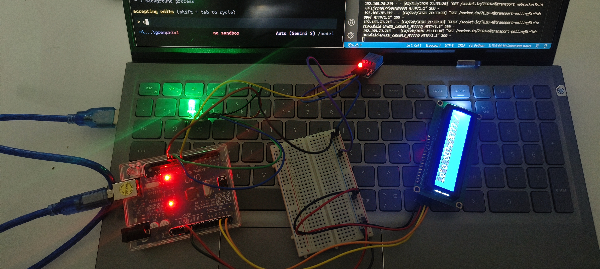

# SmartFridge Guard 🧊🌡️

O **SmartFridge Guard** é um sistema de monitoramento de temperatura e umidade em tempo real voltado para a segurança e conservação de itens em refrigeradores. O projeto utiliza um Arduino para coleta de dados de sensores e um dashboard web moderno desenvolvido em Python para visualização remota.

---

## 📸 Demonstração


*Visualização do hardware e interface do sistema.*

---

## ✨ Funcionalidades

- **Monitoramento em Tempo Real:** Leitura constante de temperatura e umidade via sensor DHT11.
- **Feedback Visual Local:**
  - **LCD I2C 16x2:** Exibe os valores diretamente no hardware.
  - **LED RGB:** Indica o estado de conservação através de cores:
    - 🟢 **Verde:** Temperatura ideal.
    - 🟡 **Amarelo:** Alerta de atenção.
    - 🔴 **Vermelho:** Estado crítico/Erro.
- **Interface Web Interativa:** Dashboard desenvolvido com Flask e SocketIO que atualiza automaticamente sem necessidade de recarregar a página.
- **Comunicação Inteligente:** Troca de dados via Serial em formato JSON.

---

## 🛠️ Tecnologias Utilizadas

### Hardware
- **Microcontrolador:** Arduino (Uno/Nano/Mega)
- **Sensor:** DHT11 (Temperatura e Umidade)
- **Display:** LCD 16x2 com Módulo I2C
- **Atuador:** LED RGB (Anodo ou Catodo Comum)

### Software
- **Linguagem:** Python 3.x
- **Framework Web:** Flask
- **Comunicação Web:** Flask-SocketIO
- **Comunicação Serial:** PySerial
- **Firmware:** C++ (Arduino IDE)

---

## 🚀 Como Executar o Projeto

### 1. Configurar o Arduino
1. Abra o arquivo `manitoramento_temp.ino` na Arduino IDE.
2. Instale as bibliotecas necessárias: `DHT sensor library` e `LiquidCrystal I2C`.
3. Faça o upload do código para o seu Arduino.

### 2. Configurar o Dashboard (Python)
1. Certifique-se de ter o Python instalado.
2. Instale as dependências via terminal:
   ```bash
   pip install flask flask-socketio pyserial
   ```
3. Navegue até a pasta `dashboard` e execute o servidor:
   ```bash
   python app.py
   ```
4. Acesse no seu navegador: `http://localhost:5050`

---

## 📂 Estrutura do Repositório

```text
manitoramento_temp/
├── dashboard/          # Código fonte do servidor web Python
│   ├── app.py          # Servidor Flask
│   └── templates/      # Páginas HTML (Dashboard)
├── image/              # Imagens e capturas de tela do projeto
└── manitoramento_temp/ # Firmware (Código .ino para Arduino)
```

---

## 👤 Autor
Desenvolvido como parte do projeto **SmartFridge Guard**.

